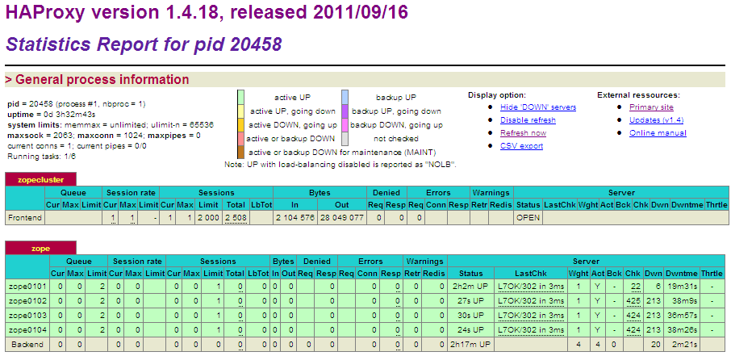

.. -*- coding: utf-8 -*-

.. highlight:: rest

.. _haproxy_setup:

====================
Balanceador de carga
====================

El problema a solucionar con balanceador de carga es la sobrecarga de los servidores, 
si el balanceador detecta la caída de uno de los servidores Web, puede optar por no 
enviarle más peticiones. De esta forma, si uno de los servidores Web se cae, las 
peticiones del cliente no se dirigen al servidor caído.

Tenga en cuenta que el balance de carga también contribuye a una infraestructura 
redundante y de alta disponibilidad. Hasta este punto yo creo conveniente introducir 
los siguientes conceptos básicos que debe manejarán:

.. glossary ::

  **Balanceador**
    Es un sistema, software o hardware, que distribuye las peticiones de los clientes 
    de forma equitativa entre distintos servidores de *"backend"*.

  **Servidor de backend**
    Es un servidor (Web en este caso), que responde la petición del usuario.

Así el balanceador distribuye las peticiones y son los servidores *backend*, quienes 
arman la respuesta efectiva al cliente.

Para balancear la carga entre varios servidores es deseable que el mismo balanceador sea 
justo *(fair)*, y que detecte servidores sobrecargados para dejar de enviarle peticiones 
hasta que no baje su carga. Este mismo mecanismo sirve para que un balanceador no envíe 
peticiones a un servidor caído.

A continuación algunas de las características deseables para un balanceador:

* Soporte de sesiones, para que el usuario conserve la sesión.
  
* Detectar servidores *backend caídos*, para no dirigir peticiones a un 
  servidor que está fuera de línea.

* Detectar servidores con mucha carga, para balancear la carga equitativamente 
  entre todos los servidores *backend* y según sus recursos.

* Algoritmos de balance, para elegir entre balance *Round-Robin*, por peso, 
  por origen, etc.

* Escalabilidad, para que sea fácil adicionar más servidores *backend* o sitios 
  hospedados.

* Ofrece *Access Control Lists (ACL)* por tipo de contenido, nombre de dominio, etc., 
  para filtrar contenido, o dirigir las peticiones por contenido estático a un servidor en 
  particular, etc.

Existen varias alternativas para **balancear HTTP por software** basadas en 
software libre y código abierto, tales como:

* `HAProxy`_ y `Pound`_ ambos balanceadores y proxy, pueden balancear HTTP y TCP. 

* `Apache`_, `Lighttpd`_ y `Nginx`_ son servidores Web.

  De estos, *Apache* puede balancear utilizando ``mod_proxy`` con ``mod_proxy_balancer``, 
  es decir son necesarios estos **módulos extras** para que balancee.
  
  *Lighttpd*, es un servidor Web liviano que soporta balance de carga pero no mantiene 
  la sesión del usuario.
  
  Por último, *Nginx*, es otro servidor Web liviano que balancea, pero a diferencia 
  de *Lighttpd*, sí soporta sesiones.

.. _que_es_haproxy:

HAProxy
=======

Formalmente `HAProxy`_, es un balanceador de carga HTTP y TCP, de entre las alternativas 
a escoger, se opto por el para esta implementación, porque ha demostrado ser muy estable, 
ofrece una interfaz de estadísticas gráfica y dispone amplia documentación con Zope y Plone.

  Logotipo de **HAProxy**.

Estadísticas de HAProxy
-----------------------

Este balanceador de carga ofrece la capacidad de configurar el sitio de estadísticas del
tráfico, lo cual es bastante útil para tener una idea del tráfico que pasa por el balanceador, 
así como el tiempo arriba y tiempo caído de los *backends*.

  Reporte Web de estadísticas de **HAProxy**.

Usted puede acceder a los recursos instalado de HAProxy con las siguientes direcciones:

* **Estadísticas del tráfico:** http://SU_DIRECCION_IP/haproxy-stats/

* **Monitor del HAProxy:** http://SU_DIRECCION_IP/haproxy-ping

Funcionamiento con Plone
========================

``HAProxy``, es utilizado en esta esquema de configuraciones como es un 
balanceador de carga HTTP y TCP que distribuye las peticiones es utilizado 
en esta esquema de configuraciones como al sitio Web (el balance de carga) 
de las solicitudes pasadas desde :ref:`Varnish <que_es_varnish>` entre los 
dos (02) :ref:`clientes ZEO <clientes_zeo>` definidos para nuestra instalación.

Instalación
===========

La instalación se realiza a través de configuraciones que usan recetas de 
instalación de buildout y funciona de esta manera:

.. code-block:: cfg

    # Zope, Varnish and Nginx URLs download versions to be used
    [downloads]
    haproxy = http://dist.jarn.com/public/haproxy-1.4.18.zip
    
    # HAProxy, used as a load haproxy over the four Zeo clients
    # For options see http://pypi.python.org/pypi/plone.recipe.haproxy
    [haproxy-build]
    recipe = plone.recipe.haproxy
    url = ${downloads:haproxy}
    cpu = ${build:cpu}
    target = ${build:target}
    pcre = 1

Configuraciones del balanceador de carga
========================================

La configuración del balanceador de carga ``HAProxy`` se crea utilizando una plantilla 
la cual genera un archivo mediante el proceso de construcción hecho por zc.buildout.

.. code-block:: cfg

    [haproxy-config]
    recipe = collective.recipe.template
    input = ${buildout:directory}/templates/haproxy.conf.in
    output = ${buildout:directory}/etc/haproxy.conf
    maxconn = ${haproxy-settings:maxconn}
    ulimit-n = ${haproxy-settings:ulimit-n}

Una muestra del archivo de configuración de ``HAProxy`` es el siguiente:

.. literalinclude:: ../templates/haproxy.conf.in
   :encoding: utf-8

En proceso de instalación y configuración se requieren algunas variables de necesarias 
para ``HAProxy``. En el archivo ``buildout.d/custom-settings.cfg`` dispone la siguiente 
configuración:

.. code-block:: cfg

    # -------------------------
    # Zope and Plone Parameters
    # -------------------------
    
    # Zope and Plone basic configurations
    # -----------------------------------
    [site-settings]
    localhost = 127.0.0.1

    [hosts]
    haproxy = ${site-settings:localhost}
    
    [ports]
    haproxy = 8201
    
    # -------------------
    # HAProxy Parameters
    # -------------------
    
    # Build configurations using by HAProxy Build task
    # ------------------------------------------------
    [build]
    cpu = x86-64
    target = linux26
    
    # HAProxy basic configurations
    # ----------------------------
    [haproxy-settings]
    user = admin
    password = admin
    maxconn = 24000
    ulimit-n = 65536
    frontend = zopecluster
    backend = zope

Cada ves que allá hecho un cambio en la configuración de este servicio aplique 
esos cambios en la plantilla ubicada en ``templates/haproxy.conf.in`` y deje el 
trabajo el trabajo de generación del archivo de configuración buildout con el 
siguiente comando: 

.. code-block:: sh

  $ ./bin/buildout -vvvv

Este comando generará el archivo en la ubicación ``etc/haproxy.conf`` el cual usara 
el servicio de HAProxy en sus configuración de arranque y reinicia el servicio ``haproxy`` 
mediante supervidor con el siguiente comando:

.. code-block:: sh

 $ ./bin/supervidorctl restart others:haproxy

Referencias
-----------

-   `Balance de carga con HAProxy`_.

-   `Sesiones en el balance de carga con HAProxy`_.

.. _HAProxy: http://haproxy.1wt.eu/
.. _Pound: http://www.apsis.ch/pound/
.. _Nginx: http://nginx.org/
.. _Lighttpd: http://www.lighttpd.net/
.. _Apache: http://httpd.apache.org/
.. _zc.buildout: http://coactivate.org/projects/ploneve/replicacion-de-proyectos-python
.. _Balance de carga con HAProxy: http://www.maestrosdelweb.com/editorial/balance-de-carga-haproxy/
.. _Sesiones en el balance de carga con HAProxy: http://www.maestrosdelweb.com/editorial/sesiones-en-el-balance-de-carga-con-haproxy/
