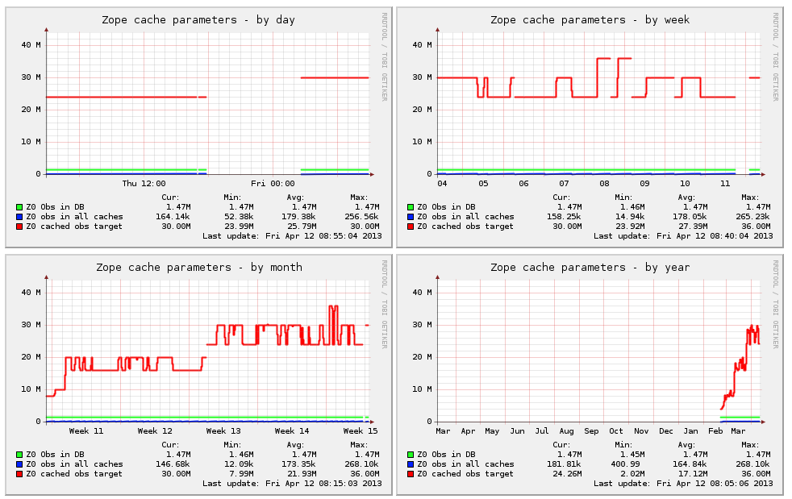

.. -*- coding: utf-8 -*-

.. highlight:: rest

.. _munin_setup:

=================
Monitorizar Plone
=================

Es necesario medir el comportamiento del Plone y sus servicios 
en el tiempo, para así poder realizar los ajustes necesarios en 
su optimización.

.. figure:: ../_static/munin-logo.png
  :alt: Munin
  :align: center
  :width: 180px

  Logotipo de Munin.

.. _que_es_munin:

Munin
=====

Para esta labor se elije `Munin`_ le permite observar el 
comportamiento del servicio Zope. Usando esta herramienta 
de monitoreo de rendimiento usted puede tener gráficas 
agradables y legibles por humanos.

Esta diseñado para ser extensible vía módulos de forma 
sencilla, para el caso de Zope existe el modulo `munin.zope`_ 
que dispone de cuatro (04) plugins diferentes:

-  Hilos de Zserver.

-  Actividad en ZODB.

-  Parámetros de cache Zope.

-  Uso de memoria de Zope.

Además estamos usando el modulo `munin.plone`_ para analizar 
algunos aspectos de sitio de Plone:

-  Creación y modificación de contenido en Plone.

Por defecto, Munin ofrece monitoreo a los siguientes recursos 
del sistema operativo y del hardware:

-  Uso del disco duro.

-  Comportamiento de la red.

-  Procesos del sistema.

-  Promedio de carga y frecuencia del uso del CPU.

-  Tiempo en ejecución activo el sistema operativo.

-  Bitácora de acceso de usuario al sistema operativo.

Opcionalmente se ha habilitado módulos de monitoreo de para 
los siguientes servicios:

-  Servidor Web con :ref:`Nginx <plugin_munin_nginx>`, para 
   este servicio se genera monitoreo a la cantidad peticiones 
   atendida y consumo de memoria.

-  Caché de contenidos con :ref:`Varnish <plugin_munin_varnish>`, 
   para esto se esta usando el modulo `munin.varnish`_.

-  Balanceo de carga con :ref:`HAProxy <plugin_munin_haproxy>`, 
   para el cual se genera modulo para supervisar su comportamiento.

Un ejemplo de estas gráficas de monitoreo se presenta a continuación:

  Gráficas de monitoreo con Munin.

Configuraciones de monitoreo
============================

Primero que todo, debe editar el archivo del servidor maestro
:file:`/etc/munin/munin.conf`.

Este es el archivo que define cada clientes el cual el servidor 
maestro ira a pedir información.

En este caso se usa un modo simple es decir, el servidor maestro 
y en cliente consultaran información desde **preview.canaima.net.ve** 
la cual es accesible en la dirección **127.0.0.1**.

Edite el archivo del servidor maestro :file:`/etc/munin/munin.conf`, 
con el siguiente comando:

.. code-block:: sh

    $ sudo vim /etc/munin/munin.conf

Asegúrese que se parezca a la siguiente configuración: ::

    # The next three variables specifies where the location of the RRD
    # databases, the HTML output, logs and the lock/pid files.  They all
    # must be writable by the user running munin-cron.  They are all
    # defaulted to the values you see here.

    dbdir   /var/lib/munin
    htmldir /var/cache/munin/www
    logdir /var/log/munin
    rundir  /var/run/munin

    # Where to look for the HTML templates
    tmpldir /etc/munin/templates

    # Where to look for the static www files
    staticdir /etc/munin/static

    # (Exactly one) directory to include all files from.
    includedir /etc/munin/munin-conf.d

    # a simple host tree
    [preview.canaima.net.ve]
        address 127.0.0.1
        use_node_name yes

Configuración del cliente
--------------------------

Debe hacer algunas configuraciones de seguridad en el nodo cliente.
A pesar que, por defecto, el nodo esta configurado para ``localhost``
únicamente autorizado para recoger datos de la misma, los nodos están
escuchando en las interfaces de red. Como medida de seguridad, vamos a
cambiar lo que el nodo se une en si a la interfaz ``loopback``.

Entonces edite el archivo :file:`/etc/munin/munin-node.conf` con el
siguiente comando:

.. code-block:: sh

    $ sudo vim /etc/munin/munin-node.conf
    
Asegúrese que se parezca a la siguiente configuración ::

    # Set this if the client doesn't report the correct hostname when
    # telnetting to localhost, port 4949
    host_name localhost.localdomain

    # A list of addresses that are allowed to connect.  This must be a
    # regular expression, since Net::Server does not understand CIDR-style
    # network notation unless the perl module Net::CIDR is installed.  You
    # may repeat the allow line as many times as you'd like
    
    allow ^127\.0\.0\.1$
    allow ^::1$
 
    # Which address to bind to;
    #host *
    host 127.0.0.1

Verifique que exista la configuración de los plugins de Munin:

.. code-block:: sh

    $ sudo vim /etc/munin/plugin-conf.d/munin-plugin-sitioweb.conf

Si no existe ejecute el comando que se agregara las configuraciones de
plugins de Plone para el servicio Munin, con el siguiente comando:

.. code-block:: sh

    $ sudo ./bin/update-so-config-sh
    
Otorgar permisos de ejecución:

.. code-block:: sh

    $ sudo chmod -R 755 /usr/share/munin/plugins/
    $ sudo chmod -R 755 /etc/munin/plugins/
    $ sudo chmod -R 755 /home/plone/sitioweb/bin/

.. _plugin_munin_zope:

Instalar plugins de Zope
========================

Para monitorear el servicio de :ref:`Zope <que_es_zope>` debe crearlo 
manualmente con el siguiente comando:

.. code-block:: sh

    $ sudo ln -s /home/plone/sitioweb/bin/sitioweb_*_client* /etc/munin/plugins/ -v

.. tip:: 
   Opcionalmente puede crearlo mediante el script ``munin`` que el asistirá, 
   con el siguiente comando:
    
    .. code-block:: sh

        $ sudo /home/plone/sitioweb/bin/munin install /etc/munin/plugins sitioweb instance
    
Pruebe su funcionamiento

.. code-block:: sh

    $ /home/plone/sitioweb/bin/sitioweb_zopememory_client1
    $ sudo /etc/munin/plugins/sitioweb_zopememory_client1

.. note:: Estos comandos varían por cada instancia creada de la 1 a la 4.

Otorgar permisos de ejecución:

.. code-block:: sh

    $ sudo chmod 755 /home/plone/sitioweb/bin/sitioweb_*_client* 

Opcionalmente puede probarlos vía Web desde la interfaz administrativa 
de depuración y el servidor Zeo, estos debe estar iniciada, y puede 
comprobar las siguientes direcciones:

- http://SU_DIRECCION_IP:8008/@@munin.zope.plugins/zopememory

- http://SU_DIRECCION_IP:8008/@@munin.zope.plugins/zodbactivity

- http://SU_DIRECCION_IP:8008/@@munin.zope.plugins/zopecache

- http://SU_DIRECCION_IP:8008/@@munin.zope.plugins/zopethreads

----

.. _plugin_munin_haproxy:

Instalar plugins de HAProxy
===========================

Para monitorear el servicio de :ref:`HAProxy <que_es_haproxy>` debe 
crearlo manualmente con el siguiente comando:

.. code-block:: sh

    sudo ln -s /home/plone/sitioweb/scripts/haproxy_backend /etc/munin/plugins/haproxy_backend

Otorgar permisos de ejecución:

.. code-block:: sh

    $ sudo chmod 755 /home/plone/sitioweb/scripts/haproxy_backend
    
----

.. _plugin_munin_varnish:

Instalar plugins de Varnish
===========================

Puede comprobar que aspectos de :ref:`Varnish <que_es_varnish>` puede 
monitorear, ejecute el siguiente comando:

.. code-block:: sh

    $ /home/plone/sitioweb/bin/munin-varnish suggest
    expunge
    transfer_rates
    objects
    uptime
    request_rate
    memory_usage
    hit_rate
    threads
    backend_traffic

Debe crearlo manualmente cada uno ejecutando los siguientes comando:

.. code-block:: sh

    sudo ln -s /home/plone/sitioweb/bin/munin-varnish \
               /etc/munin/plugins/varnish_sitioweb__expunge
    sudo ln -s /home/plone/sitioweb/bin/munin-varnish \
               /etc/munin/plugins/varnish_sitioweb__transfer_rates
    sudo ln -s /home/plone/sitioweb/bin/munin-varnish \
               /etc/munin/plugins/varnish_sitioweb__objects
    sudo ln -s /home/plone/sitioweb/bin/munin-varnish \
               /etc/munin/plugins/varnish_sitioweb__uptime
    sudo ln -s /home/plone/sitioweb/bin/munin-varnish \
               /etc/munin/plugins/varnish_sitioweb__request_rate
    sudo ln -s /home/plone/sitioweb/bin/munin-varnish \
               /etc/munin/plugins/varnish_sitioweb__memory_usage
    sudo ln -s /home/plone/sitioweb/bin/munin-varnish \
               /etc/munin/plugins/varnish_sitioweb__hit_rate
    sudo ln -s /home/plone/sitioweb/bin/munin-varnish \
               /etc/munin/plugins/varnish_sitioweb__threads
    sudo ln -s /home/plone/sitioweb/bin/munin-varnish \
               /etc/munin/plugins/varnish_sitioweb__backend_traffic

Otorgar permisos de ejecución los plugins creados, con el 
siguiente comando:

.. code-block:: sh

    $ sudo chmod 755 /home/plone/sitioweb/bin/munin-varnish
    $ sudo chmod 755 /etc/munin/plugins/varnish_*

----

.. _plugin_munin_nginx:
    
Instalar plugins de Nginx
=========================

Para monitorear el servicio de :ref:`Nginx <nginx_setup>` debe crearlo 
manualmente con el siguiente comando:

.. code-block:: sh

    sudo ln -s /home/plone/sitioweb/scripts/nginx_memory /etc/munin/plugins/nginx_memory
    sudo ln -s /usr/share/munin/plugins/nginx_request /etc/munin/plugins/ -v
    sudo ln -s /usr/share/munin/plugins/nginx_status /etc/munin/plugins/ -v

Otorgar permisos de ejecución los plugins creados, con el siguiente 
comando:

.. code-block:: sh

    $ sudo chmod 755 /home/plone/sitioweb/scripts/nginx_memory
    $ sudo chmod +x /usr/share/munin/plugins/nginx_*

Reinicie servicio Munin
=======================

Para aplicar las configuraciones realizadas debe reiniciar los 
servicios de Munin 

.. code-block:: sh

    $ sudo service munin restart
    $ sudo service munin-node restart

Programar generación de gráficas
================================

Puede usar el comando :command:`crontab` para definir cada cuanto 
quiere que genere las gráficas estadísticas de los servicios vía Web.

.. code-block:: sh

    $ sudo -u munin crontab -e

Y agregue la siguiente linea::

    */5 * * * *     /usr/bin/munin-cron

Esto define que cada 5 minutos genere las gráficas HTML, entonces 
puede iniciar la tarea con el siguiente comando:

.. code-block:: sh

    $ sudo -u munin munin-cron

De esta forma tiene disponible las gráficas HTML generadas en la 
dirección http://preview.canaima.net.ve/munin/

Referencias
-----------
  
-   `Monitoring avec Munin`_.

-   `Monitoring`_.
  
.. _Monitoring avec Munin: http://plone.fr/documentation/documentation-integrateur/munin.html
.. _Monitoring: https://svn.webmeisterei.com/repos/public/buildout-template/trunk/doc/monitoring.txt
.. _Munin: http://munin-monitoring.org/
.. _munin.zope: https://pypi.python.org/pypi/munin.zope/2.0
.. _munin.plone: https://pypi.python.org/pypi/munin.plone
.. _munin.varnish: https://pypi.python.org/pypi/munin.varnish
