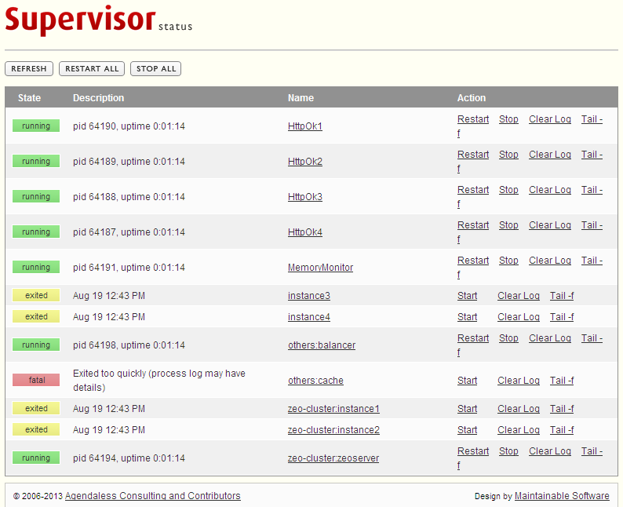

.. -*- coding: utf-8 -*-

.. highlight:: rest

.. _supervisor_setup:

=========================
Administrador de procesos
=========================

.. _que_es_supervisor:

`Supervisor`_, es un administrador de procesos que se encarga de mantener 
funcionando todas las piezas del sitio y proporciona un punto único de control 
para iniciar y detener los servicios, así como consultar su estatus, registros 
de eventos y notificaciones de esos servicios.

  Logotipo de Supervisor.

Funcionamiento con Plone
========================

Adicionalmente se habilitaron tareas de supervisión de consumo de
memoria RAM para cada :ref:`cliente ZEO <clientes_zeo>`:

-  Verifica cada 60 segundo si el :ref:`cliente ZEO <clientes_zeo>` esta al ejecutándose.

-  Si un :ref:`cliente ZEO <clientes_zeo>` excede el consumo de memoria RAM de 200 MB
   reinícielo.

Instalación
===========

La instalación se realiza a través de configuraciones que usan recetas de 
instalación de buildout y funciona de esta manera:

.. code-block:: cfg
    
    parts +=
        supervisor

    # This recipe help to install Supervisor, one to rule them all
    # For options see http://pypi.python.org/pypi/collective.recipe.supervisor
    [supervisor]
    recipe = collective.recipe.supervisor
    port = ${ports:supervisor}
    user = ${supervisor-settings:user}
    password = ${supervisor-settings:password}
    serverurl = http://${hosts:supervisor}:${ports:supervisor}
    loglevel = info
    logfile = ${buildout:var-dir}/log/supervisord.log
    logfile_maxbytes = 50MB
    logfile_backups = 10
    pidfile = ${buildout:var-dir}/supervisord.pid
    file = ${buildout:var-dir}/supervisord.sock
    chmod = 0700
    nodaemon = false
    plugins = superlance
    programs =
    #Prio, Name,      Program,                                      Params
      10 zeoserver ${buildout:bin-directory}/zeoserver [foreground] ${zeoserver:location} \
      true
      20 client1 ${buildout:bin-directory}/client1 [console] ${client1:location} true
      20 client2 ${buildout:bin-directory}/client2 [console] ${client2:location} true
      30 haproxy ${buildout:bin-directory}/haproxy [-f ${haproxy-config:output} -db] true
      40 varnish ${buildout:bin-directory}/varnish true

    eventlisteners =
    # Check every 60 seconds that no child process has exceeded. 
    # it's like a RSS memory quota
      MemoryMonitor TICK_60 ${buildout:bin-directory}/memmon \ 
      [-g zeo-clients=${quotas:instance-memory} -m ${site-settings:mail-for-errors}]

    # Check every 60 seconds whether the plone instance is alive
      HttpOk1 TICK_60 ${buildout:bin-directory}/httpok [-p client1 -t 20 \
      http://${hosts:client1}:${ports:client1}/${plone-sites:main}]
      
      HttpOk2 TICK_60 ${buildout:bin-directory}/httpok [-p client2 -t 20 \
      http://${hosts:client2}:${ports:client2}/${plone-sites:main}]

    groups =
        10 zeo-cluster zeoserver
        20 zeo-clients client1,client2
        30 others haproxy,varnish
        40 httpok HttpOk1,HttpOk2

Configuraciones de Supervisor
=============================

La configuración del servicio ``supervisor`` se crea utilizando una plantilla 
la cual genera un archivo mediante el proceso de construcción hecho por zc.buildout.

.. code-block:: cfg

  # Zope and Plone basic configurations
  # -----------------------------------
  [site-settings]
  localhost = 127.0.0.1
  
  [hosts]
  supervisor = ${site-settings:localhost}
  
  [ports]
  supervisor = 9001

  # -------------------------------
  # Supervisor basic configurations
  # -------------------------------
  [supervisor-settings]
  user = admin
  password = admin

  # -----------------
  # Quotas Parameters
  # -----------------
  [quotas]
  # Supervisor quotas
  # -----------------
  instance-memory = 800MB

Mantenimiento de supervisor
===========================

Ademas con el programa ``crontab`` ejecute cada ves que se reinicie el servidor 
se ha programado una tarea para hacer ejecutar el arranque del demonio de ``supervisor``
el cual inicia todos los servicios necesarios para que Plone este funcionado correctamente:

.. code-block:: cfg
    
    parts +=
        supervisor-crontab

    # This recipe help to Run once Supervisor, at startup.
    # For options see http://pypi.python.org/pypi/z3c.recipe.usercrontab
    [supervisor-crontab]
    recipe = z3c.recipe.usercrontab
    # copied from https://help.ubuntu.com/community/CronHowto
    times = @reboot
    command = ${buildout:bin-directory}/supervisord

Interfaz en linea de comando
============================

Para controlar todos los servicios, Supervisor le permite ejecutar por medio de 
linea de comando la administración:

.. code-block:: sh

  $ ./bin/supervisorctl 
  others:haproxy                   RUNNING    pid 4813, uptime 1 day, 21:41:21
  others:varnish                   RUNNING    pid 4814, uptime 1 day, 21:41:21
  zeo-clients:client1              RUNNING    pid 25634, uptime 1 day, 13:02:05
  zeo-clients:client2              STOPPED    Sep 08 07:50 PM
  zeo-cluster:zeoserver            RUNNING    pid 4806, uptime 1 day, 21:41:21
  supervisor> 

En este punto pude acceder a los diversos comandos disponibles para administrar 
los servicios de Supervisor.

.. code-block:: sh

  supervisor> help
  
  default commands (type help <topic>):
  =====================================
  add    clear  fg        open  quit    remove  restart   start   stop  update 
  avail  exit   maintail  pid   reload  reread  shutdown  status  tail  version
  
  supervisor> 

**Iniciar un proceso**

Para este ejemplo iniciara el :ref:`cliente ZEO <clientes_zeo>`, con el siguiente comando:

.. code-block:: sh

  supervisor> start zeo-clients:client1
  zeo-clients:client1: started

**Iniciar todos los procesos de un grupo**

Para este ejemplo iniciara todos los :ref:`clientes ZEO <clientes_zeo>` definidos en el 
grupo de proceso ``zeo-clients``, con el siguiente comando:

.. code-block:: sh

  supervisor> start zeo-clients:*

**Iniciar todos los procesos**

Para este ejemplo iniciara todos los procesos definidos, con el siguiente comando:

.. code-block:: sh

  supervisor> start all
  zeoserver: started
  client2: started
  client1: started
  haproxy: started
  varnish: started

.. _referencias_comandos:

Referencias de comandos
=======================

Para mas información consulte la ayuda del comando ``add``, con el siguiente comando:

.. code-block:: sh

  supervisor> help add
  add <nombre> [...] Activa cualquier actualización en la configuración del proceso.

Para mas información consulte la ayuda del comando ``clear``, con el siguiente comando:

.. code-block:: sh

  supervisor> help clear
  clear <nombre>		Borrar archivos de registro de un proceso.
  clear <nombre> <nombre>	Borrar archivos de registro de múltiples procesos.

Para mas información consulte la ayuda del comando ``fg``, con el siguiente comando:

.. code-block:: sh

  supervisor> help fg
  fg <proceso>	Conecta a un proceso en modo foreground
  Presione Ctrl+C para salir del modo foreground

Para mas información consulte la ayuda del comando ``maintail``, con el siguiente comando:

.. code-block:: sh

  supervisor> help maintail
  maintail -f 	Continuo tail del archivo log principal supervisor (Ctrl-C para salir).
  maintail -100	ultimo 100 *bytes* del archivo de registro principal supervisord.
  maintail	ultimo 1600 *bytes* del archivo de registro principal supervisor.

Para mas información consulte la ayuda del comando ``open``, con el siguiente comando:

.. code-block:: sh

  supervisor> help open
  open <url>	Conecta a un proceso remoto supervisord.
  		(para UNIX socket de dominio, use unix:///socket/path)

Para mas información consulte la ayuda del comando ``pid``, con el siguiente comando:

.. code-block:: sh

  supervisor> help pid
  pid		Obtener el PID de supervisord.

Para mas información consulte la ayuda del comando ``reload``, con el siguiente comando:

.. code-block:: sh

  supervisor> help reload
  reload 	Iniciar de nuevo el supervisord remoto.

Para mas información consulte la ayuda del comando ``remove``, con el siguiente comando:

.. code-block:: sh

  supervisor> help remove
  remove <nombre> [...]	Elimina procesos / grupo de procesos de la configuración activa.

Para mas información consulte la ayuda del comando ``reread``, con el siguiente comando:

.. code-block:: sh

  supervisor> help reread
  reread 	Actualizar los archivos de configuración del demonio.

Para mas información consulte la ayuda del comando ``shutdown``, con el siguiente comando:

.. code-block:: sh

  supervisor> help shutdown
  shutdown 	Apaga el supervisord remoto.

Para mas información consulte la ayuda del comando ``start``, con el siguiente comando:

.. code-block:: sh

  supervisor> help start
  start <nombre>		Inicia un proceso.
  start <gname>:*		Inicia todos los procesos en un grupo.
  start <nombre> <nombre>	Inicia múltiples procesos o grupo de procesos.
  start all			Inicia todos los procesos.

Para mas información consulte la ayuda del comando ``status``, con el siguiente comando:

.. code-block:: sh

  supervisor> help status
  status			Obtén toda la información del estado del proceso.
  status <nombre>		Obtén el estado de un simple proceso por nombre.
  status <nombre> <nombre>	Obtener el estado de varios procesos mencionados.

Para mas información consulte la ayuda del comando ``stop``, con el siguiente comando:

.. code-block:: sh

  supervisor> help stop
  stop <nombre>			Detiene un proceso.
  stop <gname>:*		Detiene todos los procesos en un grupo.
  stop <nombre> <nombre>	Detener múltiples procesos o grupos de procesos.
  stop all			Detiene todos los procesos.

Para mas información consulte la ayuda del comando ``tail``, con el siguiente comando:

.. code-block:: sh

  supervisor> help tail
  tail [-f] <nombre> [stdout|stderr] (default stdout)
  Ex:
  tail -f <nombre>	Cola continua del proceso llamado stdout.
  			Ctrl-C para salir.
  tail -100 <nombre>	ultimo 100 *bytes* del proceso stdout.
  tail <nombre> stderr	ultimo 1600 *bytes* del proceso stderr.

Para mas información consulte la ayuda del comando ``update``, con el siguiente comando:

.. code-block:: sh

  supervisor> help update
  update		Actualizar configuración y añadir / quitar según sea necesario.

Para mas información consulte la ayuda del comando ``version``, con el siguiente comando:

.. code-block:: sh

  supervisor> help version
  version		Mostrar la versión del proceso remoto supervisord.

**Ejecutando con parámetros**

Otra forma de ejecutar Supervisor es suministrar parámetros al momento de ejecución, 
un ejemplo del comando ``status`` con el siguiente comando:

.. code-block:: sh

  $ ./bin/supervisorctl status
  others:haproxy                   RUNNING    pid 4813, uptime 1 day, 21:40:03
  others:varnish                   RUNNING    pid 4814, uptime 1 day, 21:40:03
  zeo-clients:client1            STOPPED    pid 25634, uptime 1 day, 13:00:47
  zeo-clients:client2            RUNNING    pid 25631, uptime 1 day, 13:00:47
  zeo-cluster:zeoserver            RUNNING    pid 4806, uptime 1 day, 21:40:03

Esta forma de ejecutar vía linea de comando con Supervisor, es aplicable a todos en 
la sección disponible llamada :ref:`Referencias de comandos Supervisor <referencias_comandos>`.

**Ejecutando el demonio**

Opcionalmente puede iniciar todos los procesos definidos en la configuraciones de 
Supervisor con el siguiente comando:

.. code-block:: sh

  $ ./bin/supervisord

Interfaz Web de Supervisor
==========================

Una característica de *Supervisor* es su interfaz de administración Web
de servicios que dispone desde la cual puede consultarse el estado de
los servicios. Desde ahí es posible iniciar o detener cualquiera de
ellos, como se ilustra a continuación:

  Interfaz Web de Supervisor.

Usted puede a la Interfaz Web de Supervisor que supervisa los servicios
que despliegan la Plone a través de la siguiente dirección:

* **Interfaz Web administrativa de Supervisor**: `http://SU_DIRECCION_IP:9001/ <http://SU_DIRECCION_IP:9001/>`_.

Referencias
-----------

-   `Buildout para instalar de todas las partes de un sitio`_.

.. _Supervisor: http://supervisord.org/
.. _Buildout para instalar de todas las partes de un sitio: http://plone-spanish-docs.readthedocs.org/en/latest/buildout/plone-esquema-alta-disponibilidad.html
