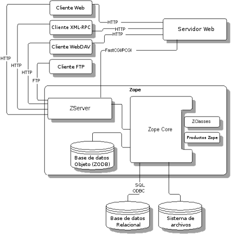

.. -*- coding: utf-8 -*-

.. highlight:: rest

.. _zope_setup:

============================================
Servidor de Objetos empresariales Zope – ZEO
============================================

.. _que_es_zope:

Zope es un entorno de desarrollo para la creación de aplicaciones Web.

  Logotipo de Zope.

Arquitectura de Zope
====================

Además proporciona infraestructura y servicios que agilizan enormemente el 
desarrollo, que consiste en varios componentes diferentes que trabajan de 
manera conjunta para ayudarte a construir aplicaciones Web que se describen 
a continuación:

  Arquitectura de Zope.

Un servidor Web orientado a objeto, que se encarga de servir los contenidos tanto a 
usted como a tus usuarios, y fue el primer sistema utilizando la metodología objeto 
de publicación ahora común para la Web.

El :ref:`Servidor ZEO <servidor_zeo>` será el hospedaje principal de la :ref:`ZODB <que_es_zodb>` 
y mantendrá el contenido actual del sitio. 

.. tip::
   Opcionalmente se puede habilitar un segundo servidor ZEO es agregado para respaldo 
   y para tolerancia a fallos.

ZServer
-------

Zope viene con un servidor Web incorporado que sirve contenido a usted y sus usuarios. 
Este servidor Web también sirve contenido Zope a través de FTP, WebDAV y XML-RPC 
(un servicio de llamada a procedimiento remoto).

Web Server
----------

Puede que dispongas ya en tu sistema de otro servidor Web, como Apache o 
Microsoft IIS Y es posible que no desee utilizar el servidor Web de Zope. 
No te preocupes, Zope trabaja también con estos servidores Web modernos 
que soportan a CGI, HTTP/WebDAV, XML-RPC, FTP y WSGI.

En entornos de producción, puede ser ventajoso para ejecutar un servidor 
como Apache o Squid *"frente a"* Zope con el fin de ayudar a sanear las 
solicitudes de entrada, aumentar sus capacidades (por ejemplo, terminar 
las conexiones HTTPS) y contenido proporcionado por Zope cacheado.

Zope Core
---------

Este es el motor que coordina la actividad de Zope, conduciendo su interfaz 
de gestión de base de datos y objetos.

Object Database
---------------

Cuando se trabaja con Zope, que suelen trabajar con objetos que se almacenan 
en el ZODB.

Relational database
-------------------

Usted no tiene que almacenar su información en la base de datos de objetos 
de Zope si no quieres. Zope también trabaja con otras bases de datos relacionales, 
incluyendo *Oracle*, *PostgreSQL*, *Sybase*, y *MySQL*.

File System
-----------

Zope puede, por supuesto, trabaja con documentos y otros archivos almacenados 
en su sistema de archivos del servidor.

Products
--------

Zope también permite a los administradores de sitios para agregar nuevos tipos de 
objetos pre-construidos para Zope mediante la instalación de complementos en el 
sistema de archivos del servidor Zope. Estos se conocen como productos o complementos. 
Técnicamente son paquetes de Python normales.

.. _servidor_zeo:

Servidor Zope Enterprise Objects
================================

El Servidor Zope Enterprise Objects – ZEO, es un servicio que esta configurado de forma 
de cluster para que puedan atender las diversas peticiones de clientes Zeo que ejecuta 
la aplicación Plone. 

En este esquema de publicación se instalara `Zope2`_ en modo **Zeo** y así se define 
en el archivo ``plone-4.3.4.cfg`` de esta forma:

.. code-block:: cfg

    [zeoserver_base]
    # Process
    # If we try to start as root, Zope will switch to the user below
    effective-user = ${site-settings:user-server}

    # Storage
    blob-storage   = ${buildout:var-dir}/blobstorage

    # Packing
    pack-days      = ${maintenance:pack-day}

    # Customization
    eggs =
        ZODB3
        mailinglogger

    # Logging
    # Put the log, pid and socket files in var/zeoserver
    zeo-log        = ${buildout:var-dir}/${:_buildout_section_name_}/zeoserver.log
    pid-file       = ${buildout:var-dir}/${:_buildout_section_name_}/zeoserver.pid
    socket-name    = ${buildout:var-dir}/${:_buildout_section_name_}/zeo.zdsock

En el mismo archivo se define la sección llamada ``[zeoserver]`` la cual extiende 
las configuraciones de la sección ``[zeoserver_base]`` para del servidor Zeo llamado ``zeoserver``. 
A continuación ejemplo de configuraciones buildout:

.. code-block:: cfg

    # For options see http://pypi.python.org/pypi/plone.recipe.zeoserver
    [zeoserver]
    <= zeoserver_base
    recipe         = plone.recipe.zeoserver
    zeo-address    = ${hosts:zeoserver}:${ports:zeoserver}

En el mismo archivo se define la sección llamada ``[zeoserver]`` la cual extiende 
las configuraciones de la sección ``[zeoserver_base]`` para el servidor Zeo.

.. note::
   La sección llamada ``[zeoserver_base]`` se usa como plantilla de configuraciones 
   para la creaciones de servidores Zeo.

.. _clientes_zeo:

Clientes Zeo
============

Los clientes Zope Enterprise Objects – ZEO, son clientes Web que esta configurados 
de forma de cluster para que puedan atender las diversas peticiones al servidor de 
aplicación ZEO que ejecuta la aplicación Plone. 

Se crearon dos (02) clientes ZEO con dos hilos por cada cliente, los cuales procesarán 
las solicitudes y publicarán los resultados a la llamada del navegador.

Usted puede acceder a la Plone a través de los diversos clientes Zeo con las 
siguientes direcciones:

- Primera Instancia Zope como cliente Zeo, Se ejecuta bajo el puerto **8080**, no es accesible 
  de forma publica por practicas de seguridad.
  
- Segunda Instancia Zope como cliente Zeo, Se ejecuta bajo el puerto **8004**, no es accesible 
  de forma publica por practicas de seguridad.
  
- Opcionalmente se genera una cliente Zeo para depuración del servidor Zope, Esta se iniciar 
  cuando se requiere por defecto esta apagada. Se ejecuta bajo el puerto **8008**, en la dirección 
  URL http://SU_DIRECCION_IP:8008/

En el archivo ``plone-4.3.4.cfg`` se define la parte mas importante aquí la sección llamada 
``[client_base]``, que representa una definición de molde que contendrá valores de configuración 
que serán utilizados por los dos (02) clientes Zeo. Siempre se recomienda utilizar variables 
para la definición de *hosts* y *puertos*, de tal forma que puedan configurarse en una sección 
separada:

.. code-block:: cfg

    # Default settings for ZEO clients.
    # ZEO clients basic configurations.
    # For options see http://pypi.python.org/pypi/plone.recipe.zope2instance
    [client_base]
    # Common options
    eggs             = ${buildout:eggs}
    zcml             = ${buildout:zcml}
    zserver-threads  = ${instance:zserver-threads}
    zodb-cache-size  = ${buildout:zodb-cache-size}
    environment-vars = ${buildout:environment-vars}

    # Basic ZEO storage
    zeo-address      = ${zeoserver:zeo-address}
    zeo-client       = true
    blob-storage     = ${buildout:var-dir}/blobstorage
    shared-blob      = on
    user         = ${site-settings:instance_username}:${site-settings:instance_password}

    # Load non-setuptools compatible Python libraries
    products         = ${buildout:directory}/products/

    # Advanced ZEO options
    zeo-client-cache-size = 300MB

    # Advanced options
    effective-user       = ${site-settings:user-server}
    zope-conf-additional = ${buildout:zope-conf-additional}

    # Development options
    debug-mode           = ${instance:debug-mode}
    deprecation-warnings = ${instance:deprecation-warnings}
    verbose-security     = ${instance:verbose-security}
    security-policy-implementation = ${instance:security-policy-implementation}

    # Logging
    event-log-level      = ${instance:event-log-level}
    #copied from http://stackoverflow.com/questions/5993334/error-notification-on-plone-4
    mailinglogger =
      <mailing-logger>
        level error
        flood-level 10
        smtp-server ${site-settings:mail-smtp-url}
        from ${site-settings:mail-logger}
        to ${site-settings:mail-for-errors}
        subject [Error en ${site-settings:domain-name-production}] [%(hostname)s] %(line)s
      </mailing-logger>

.. note::
   La sección llamada ``[client_base]`` se usa como plantilla de configuraciones 
   para la creaciones de servidores Zeo.

En el mismo archivo se define la sección llamada ``[client1]`` la cual extiende 
las configuraciones de la sección ``[client_base]`` para el primer cliente Zeo llamado ``client1``. 
A continuación ejemplo de configuraciones buildout:

.. code-block:: cfg

    [client1]
    <= client_base
    recipe       = plone.recipe.zope2instance
    http-address = ${hosts:client1}:${ports:client1}
    port-base    = 0
    # Logging
    # Put the log, pid, loc files in var/client1
    event-log    = ${buildout:var-dir}/${:_buildout_section_name_}/event.log
    z2-log       = ${buildout:var-dir}/${:_buildout_section_name_}/Z2.log
    pid-file     = ${buildout:var-dir}/${:_buildout_section_name_}/client1.pid
    lock-file    = ${buildout:var-dir}/${:_buildout_section_name_}/client1.lock

Seguidamente el archivo ``development.cfg`` se extiende las configuraciones del cliente Zeo 
``client1`` para el perfil de desarrollo mas habilita modos de depuración y herramientas de 
desarrollo.

.. code-block:: cfg
    
    parts +=
        client1

    [client1]
    debug-mode = on
    event-log-level = debug
    verbose-security = on
    eggs += ${buildout:package-name}
    #zcml += ${buildout:package-name}
    environment-vars +=
        zope_i18n_compile_mo_files true
        CHAMELEON_DEBUG true
        RELOAD_PATH ${buildout:directory}/src

Seguidamente el archivo ``production.cfg`` define configuraciones propias del perfil de producción 
habilitando tres (03) clientes Zeo adicionales y una cliente Zeo para depuración.

.. code-block:: cfg

    parts +=
        client2
        client-debug

    [client2]
    <= client_base
    recipe            = plone.recipe.zope2instance
    port-base         = 1
    http-address      = ${hosts:client2}:${ports:client2}
    # Put the log, pid, loc files in var/client2
    event-log         = ${buildout:var-dir}/${:_buildout_section_name_}/event.log
    z2-log            = ${buildout:var-dir}/${:_buildout_section_name_}/Z2.log
    pid-file          = ${buildout:var-dir}/${:_buildout_section_name_}/client2.pid
    lock-file         = ${buildout:var-dir}/${:_buildout_section_name_}/client2.lock

    # Zeo client instance for debugging
    [client-debug]
    <= client_base
    recipe           = plone.recipe.zope2instance
    http-address     = ${hosts:client-debug}:${ports:client-debug}
    zeo-address      = ${hosts:zeoserver}:${ports:zeoserver}
    debug-mode       = on
    verbose-security = on
    zodb-cache-size  = 5000
    # Put the log, pid, loc files in var/client-debug
    event-log        = ${buildout:var-dir}/${:_buildout_section_name_}/event.log
    z2-log           = ${buildout:var-dir}/${:_buildout_section_name_}/Z2.log
    pid-file      = ${buildout:var-dir}/${:_buildout_section_name_}/client-debug.pid
    lock-file     = ${buildout:var-dir}/${:_buildout_section_name_}/client-debug.lock

Codificación UTF-8
==================

Para habilitar soporte a caracteres UTF-8 se debe agregar un *script Python* 
que defina *default encoding* como **utf-8**, para esto se usa el 
`collective.recipe.template`_ que genera un *script Python* dando permisos 
respectivos dentro del directorio de cada cliente Zeo.

.. code-block:: cfg

    parts +=
        sitecustomize-base
        client1-sitecustomize
        client2-sitecustomize
        client-debug-sitecustomize

    [client1-sitecustomize]
    <= sitecustomize-base
    output = ${client1:location}/sitecustomize.py

    [client2-sitecustomize]
    <= sitecustomize-base
    output = ${client2:location}/sitecustomize.py

    [client-debug-sitecustomize]
    <= sitecustomize-base
    output = ${client-debug:location}/sitecustomize.py

Los nombres de servidores, puertos y otras opciones comunes pueden cambiarse 
en las secciones que se encuentran al inicio de este archivo. Estos son los valores 
que se utilizan en la sección de construcción definida arriba:

.. code-block:: cfg

    # Zope and Plone basic configurations
    # -----------------------------------
    [site-settings]
    localhost = 127.0.0.1
    ip-server = SU_DIRECCION_IP

    # Hostnames or ips from servers that hosting
    # all various servers, nginx is the main services
    [hosts]
    zeoserver    = ${site-settings:localhost}
    client1      = ${site-settings:localhost}
    client2      = ${site-settings:localhost}
    client-debug = ${site-settings:ip-server}

    # Servers ports, The called "nginx" is the main web server
    [ports]
    zeoserver    = 8009
    client1      = 8080
    client2      = 8004
    client-debug = 8008

Referencias
-----------

-   `Buildout para instalar de todas las partes de un sitio`_.

.. _Zope2: http://pypi.python.org/pypi/plone.recipe.zope2instance
.. _plone.recipe.zope2instance: http://pypi.python.org/pypi/plone.recipe.zope2instance
.. _collective.recipe.template: http://pypi.python.org/pypi/collective.recipe.template
.. _Buildout para instalar de todas las partes de un sitio: http://plone-spanish-docs.readthedocs.org/en/latest/buildout/plone-esquema-alta-disponibilidad.html
