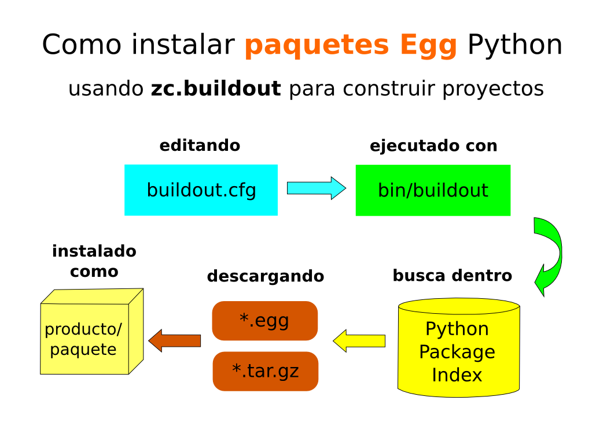

.. -*- coding: utf-8 -*-

.. _python_buildout:

===============================
Replicación de proyectos Python
===============================

.. sidebar:: Sobre este artículo

    :Autor(es): Leonardo J. Caballero G.
    :Correo(s): leonardoc@plone.org
    :Compatible con: Python 2.4 o versiones superiores
    :Fecha: 23 de Marzo de 2015

.. _que_es_zcbuildout:

¿Qué es zc.buildout?
====================

Es una herramienta que replica todo un entorno de trabajo aislado. Esto es
una buena práctica para experimentar con código y el estar familiarizado con
estas herramientas será beneficioso para desarrollar e implantar
aplicaciones.

.. _buildout_caracteristicas:

Características
---------------
Estas son sus principales características:

- **Basado en Python**, es una utilidad escrita en el lenguaje de programación 
  Python, esto le permite agregar nuevas extensiones vía módulos a la herramienta.

- **Sintaxis declarativa**, permite definición de configuraciones buildout de 
  forma declarativa, basada en el formato .INI de Windows, es decir, 
  ``clave = valor``, haciendo esto una ventaja a las otras herramientas de 
  auto-construcción de proyectos ya que su sintaxis es de fácil entendimiento 
  ya que esta es un lenguaje de configuración de alto nivel.
  
  .. code-block:: ini
    
    ; last modified 1 April 2001 by John Doe
    [owner]
    name = John Doe
    organization = Acme Widgets Inc.
    
    [database]
    ; use IP address in case network name resolution is not working
    server = 192.0.2.62
    port = 143
    file = "payroll.dat"

  Este sistema de auto-construcción es súper sencillo de escribir esta basado 
  en la configuraciones de archivo .ini de Windows, es decir, ``clave =  valor`` 
  mas adicionalmente ofrece el concepto de los recetas te permite usar tareas 
  predefinidas para construir un servidor Zope, instalar un servidor de MySQL 
  o PostgreSQL, o instalando lenguaje de programación como Python, PHP en fin. 

- **Facilita el día a día del trabajo**, Orientado al programador y administradores 
  de sistemas.

- **Se puede replicar**, eso quiere decir que puedes configurar que instalar, 
  y como configurar cosas en tu proyecto con la finalidad de agilizar el despliegue 
  de proyectos en entornos de desarrollo, pruebas y producción.
    
- **Integración con sistema de paquetes**, es fácil trabajar con los formatos 
  de :term:`paquetes Egg`.

¿Por que usar zc.buildout?
==========================

Para entender por que es de utilidad zc.buildout hay que conocer las cosas que 
conllevaron a su creación de herramienta hace unos años atrás la instalación de 
aplicaciones en Python que tenias muchas dependencias era un dolor de cabeza ya 
que tenia que instalar manualmente las dependencias en tu sistema para poder 
iniciar la instalación de tu aplicación, entonces la solución en ese momento fue 
crear un paquete de tipo :term:`bundle` el cual consistía en un archivo comprimido 
con todos los módulos que son necesario compilar o instalar en el :term:`PYTHONPATH` 
de tu interprete :command:`python`.

**Ventajas:**

- En su momento no existía :term:`paquetes Egg` ni mecanismos de solución de dependencias 
  y esto facilitaba la solución de dependencias necesarias para su instalación.

**Desventajas:**

- Era casi imposible actualizar las librerías prácticamente tenias dos opciones: 
  primero aplicabas parches a las librerías o segundo hacer una instalación que 
  incluya los parches de seguridad y mueves la data hacia allá.

Entonces paulatinamente la comunidad de Zope le fue natural que crearan un sistema 
de auto-construcción como :file:`Makefile` o Apache Ant pero basado en Python que 
le ayuda a reconstruir sus instalaciones, entonces para esto crearon `Buildout`_.

En ejemplo típico de `Plone en entornos de producción`_ no solo es Plone, sino un 
caché de contenidos, balanceo de cargas, motor de plantillas, servidor Web y todo 
esto se puede construir con Buildout.

Hasta puedes usar buildout para construir una `instalación LAMP`_ en este caso un 
ejemplo de como instalar Wordpress.

Desde la adopción de Plone de buildout se ha simplificado la instalaciones de Plone 
y se ha creado todo un sistema de replicación de entornos de trabajos al cual puedes 
acceder actualizaciones de módulos Python de forma mas sencilla a nivel administrativo.

Progresivamente fue natural que buildout implementara soporte a :term:`paquetes Egg`, 
esto impulsado por la fundación Python como una norma de crear aplicaciones que puedan 
ser distribuidas baja su filosofía de módulos y paquetes. Esto causo que Zope siendo 
un paquete :term:`bundle` se separa en muchos :term:`paquetes Egg` y fue algo natural 
que Plone también ;)

    "Buildout, es un :file:`Makefile` con esteroides" -`Francisco Palm`_.

Terminología
------------

Hay que entender varios conceptos antes de continuar tales como :term:`buildout`, 
:term:`part` y :term:`recipe`.

Instalación
===========
Puedes instalar ``zc.buildout`` usando `pip`_ (es recomendable 
hacerlo dentro de un `entorno virtual`_):

.. code-block:: sh

  $ pip install zc.buildout

Funcionamiento
==============
La herramienta ``zc.buildout`` funciona en base a los siguientes pasos ilustrados e 
descritos a continuación:
 

  Como instalar Paquetes Egg Python

#. Las configuraciones se efectúan en el archivo :ref:`buildout.cfg <buildout_cfg>`.

#. Luego de editar sus configuraciones ejecute el comando :file:`bin/buildout`.

#. Entonces ``zc.buildout`` consulta dentro :term:`Python Package Index` 
   para comprobar la existencia del paquetes a descargar.

#. Descarga los :term:`paquetes Egg` (archivos .egg / .tar.gz) y sus dependencias que 
   estén publicados en :term:`PyPI`.

#. Finalmente se encarga de instalar en el :term:`PYTHONPATH` el(los) paquete(s) 
   para estar disponible desde una `consola interactiva Python`_ 
   o para ser usado en sus códigos fuentes Python.

Configuraciones genéricas
=========================
Usted puede agregar las configuraciones genéricas para todos sus proyectos 
Buildout, para esto debe ejecutar los siguientes comando:

.. code-block:: sh

  $ mkdir $HOME/.buildout ; mkdir $HOME/.buildout/{downloads,eggs,extends,zope}
  $ nano $HOME/.buildout/default.cfg

Luego de crear el archivo :file:`default.cfg` defina algunas configuraciones de 
usuario predeterminadas para cualquier parte de su configuración :term:`buildout`:

.. code-block:: cfg

  [buildout]
  download-cache = /ruta/absoluta/al/home/del/usuario/.buildout/downloads
  eggs-directory = /ruta/absoluta/al/home/del/usuario/.buildout/eggs
  extends-cache = /ruta/absoluta/al/home/del/usuario/.buildout/extends
  zope-directory = /ruta/absoluta/al/home/del/usuario/.buildout/zope

.. note::

  Esto solamente proveerá valores predeterminados, ¡éstos no sobrescribirán 
  las configuraciones en su configuraciones buildout!

Creación de proyectos buildout
==============================
Ahora crea una nueva configuración ``zc.buildout`` así:

.. code-block:: sh

  $ mkdir mibuildout ; cd mibuildout
  $ buildout init

Ahora el nuevo directorio :file:`mibuildout` es un proyecto **buildout**.

.. _buildout_cfg:

El archivo de configuración predeterminado del buildout es :file:`buildout.cfg`. 
Después de inicializar, tendrá el siguiente contenido:

.. code-block:: cfg

  [buildout]
  parts =

Puedes cambiarlo a:

.. code-block:: cfg

  [buildout]

  parts = py

  [py]
  recipe = zc.recipe.egg
  interpreter = python
  eggs = zope.component

Ahora ejecuta el comando :command:`buildout` disponible dentro del directorio
:file:`mibuildout/bin` sin ningún argumento. Esto creará un nuevo interprete 
Python dentro del directorio :file:`mibuildout/bin`:

.. code-block:: sh

  $ ./bin/buildout

Esto creará un nuevo intérprete Python dentro del directorio
:file:`mibuildout/bin`:

.. code-block:: sh

  $ ./bin/python

Y luego tendrá a disposición en su :term:`PYTHONPATH` el paquete que instalo
`zope.component`_, como se demuestra a continuación: 

.. code-block:: python

  >>> import zope.component

Utilizando ``zc.buildout`` con la :term:`recipe` llamado `zc.recipe.egg`_ se 
puede crear un intérprete :command:`python` con los :term:`paquetes Egg` especificados.

Este comando ejecutará un intérprete de :command:`python` que puedes usar para ejecutar
el código de su proyecto.

Descarga código fuente
======================

Para descargar el código fuente de este ejemplo ejecute el siguiente comando:

.. code-block:: sh

  $ git clone https://github.com/plone-ve/buildout.basic.git

Conclusiones
============

Este ejemplo intenta mostrar las capacidades del `zc.buildout`_ con el
interprete :command:`python` de su entorno de desarrollo.

Referencias
===========

-   `Arquitectura de componentes Zope`_.

.. _zc.buildout: http://pypi.python.org/pypi/zc.buildout/
.. _zope.component: http://pypi.python.org/pypi/zope.component
.. _zc.recipe.egg: http://pypi.python.org/pypi/zc.recipe.egg
.. _Buildout: http://www.buildout.org/
.. _Plone en entornos de producción: http://plone-spanish-docs.readthedocs.org/es/latest/buildout/plone_esquema_alta_disponibilidad.html
.. _instalación LAMP: http://docs.pythonpackages.com/en/latest/hosted-configs/wordpress.html
.. _formato .INI: http://es.wikipedia.org/wiki/INI_%28extensi%C3%B3n_de_archivo%29
.. _Francisco Palm: https://github.com/fpalm
.. _pip: http://plone-spanish-docs.readthedocs.org/es/latest/python/distribute_pip.html#que-es-pip
.. _entorno virtual: http://plone-spanish-docs.readthedocs.org/es/latest/python/creacion_entornos_virtuales.html
.. _consola interactiva Python: http://plone-spanish-docs.readthedocs.org/es/latest/python/una_pequena_inmersion_python.html
.. _Arquitectura de componentes Zope: http://plone-spanish-docs.readthedocs.org/es/latest/programacion/zca/zca-es.html
