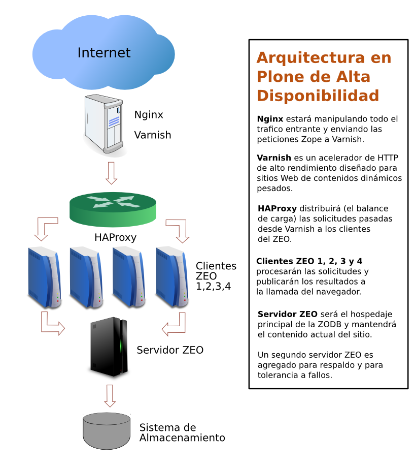
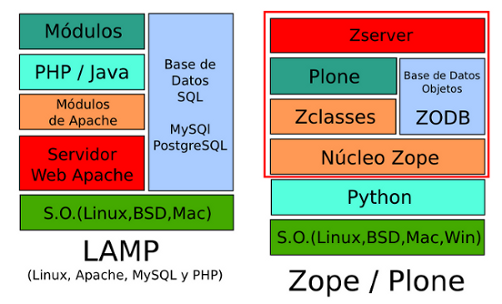

.. -*- coding: utf-8 -*-

.. highlight:: rest

.. _introduccion:

============
Introducción
============

Esta documentación le enseñará a como hacer instalaciones y aplicar 
sus configuraciones para instalar Plone en entornos de producción para 
`Canaima GNU/Linux <http://.canaima.softwarelibre.gob.ve/>`_.

.. _acerca_portal_web:

Acerca del portal web
=====================

En el proyecto Canaima GNU/Linux se utiliza en su sitio Web el CMS llamado 
Plone, con la finalidad de facilitar la carga y consulta de las noticias, 
eventos, archivos, galerías de imágenes, grupos de trabajo, flujos de publicación 
para contenidos, etc; de forma más eficiente. 

  Logotipo de **Canaima GNU/Linux**.

El sitio Web del proyecto hasta la fecha en la organización, puede 
consultar la plataforma en la siguiente dirección http://preview.canaima.net.ve/

.. _caso_estudio:

El caso de estudio
==================

El caso de estudio que es utilizado en este documento intenta explicar 
un caso complejo de instalación de Plone en entornos de producción bajo 
:ref:`Debian GNU/Linux <debian7>`, el cual permite:

* **Comportamiento del servicio separado por capas**, esto es ideal para 
  organizaciones donde diversas personas tiene la potestad de administrar 
  un servicio en especifico por separado.

* **Replicación de las capas de servicios**, esta esquema de instalación 
  permite configurar con cambios mínimos cada servicio por separado, instalar 
  y ejecutar estos  en sistema operativos distintos.

.. _requerimientos:

Requerimientos
--------------

A continuación una ilustración del esquema de publicación requerido para 
el servidor en producción, (Ver Figura 1.1).

  Arquitectura en Plone de Alta Disponibilidad

* Debe tener un (01) :ref:`servidor ZEO <servidor_zeo>`.

* Debe tener de dos (02) :ref:`clientes ZEO <clientes_zeo>`.

* Debe tener de un (01) :ref:`cliente ZEO <clientes_zeo>` para depuración.

* Servidor Web usando :ref:`Nginx <nginx_setup>` orquestado con el servidor 
  caché.

* Servidor de caché usando :ref:`Varnish <que_es_varnish>` orquestado con el 
  servidor de balanceo de carga.

* Servidor de balanceo de carga usando :ref:`HAProxy <que_es_haproxy>` orquestado 
  con los dos (02) :ref:`clientes ZEO <clientes_zeo>`.

* Los dos (02) :ref:`clientes ZEO <clientes_zeo>` orquestado con el 
  :ref:`servidor ZEO <servidor_zeo>`.

* El demonio de :ref:`Supervisor <que_es_supervisor>` configurado con el 
  stack de servicios, (Ver Figura 1.1).

* Disponer monitoreo de recursos de hardware y software usando :ref:`Munin <que_es_munin>`.

* Cada :ref:`cliente ZEO <clientes_zeo>` debe disponer soporte a caracteres UTF-8.

* Debe tener tareas de mantenimiento para rotar los archivos de logs.

* Debe tener tareas de mantenimiento para respaldar la ZODB y los archivos blob.

* Debe tener el :term:`Producto Plone` adicional para la generación de formulario de datos 
  llamado ``Products.PloneFormGen``, el cual pueda ser activado en el sitio Web Plone creado.

.. _modos_instalacion:

Modos de instalación
====================

Tradicionalmente las aplicaciones basadas en Linux, Apache, MySQL y PHP - LAMP requiere 
instalar un servidor Web y sus módulos, servidor de base de datos, lenguaje de aplicación, 
etc, cada uno se instala y configura por separado.

Para el servidor Zope / Plone no es muy distinto a las instalaciones LAMP, (Ver Figura 1.2), 
Más en cambio con Plone tiene un ventaja competitiva vs. LAMP la cual le puede construir, 
instalar y configurar de forma casi automática un servidor Web y sus módulos, servidor de 
base de datos, lenguaje de aplicación y sus módulos, etc; gracias a la herramienta :term:`buildout`.

  Stack de instalación de LAMP y Plone.

Referencias
-----------

Más información sobre otras esquemas o forma de instalar en producción Zope y Plone consulte 
los siguientes enlaces a continuación:

* `Escalamiento y ejecución de Plone`_.

* `Guide to deploying and installing Plone in production`_.

* `Installing and Staring Zope`_.

.. _Escalamiento y ejecución de Plone: http://scalingplone.pbworks.com/FrontPage-ES
.. _Guide to deploying and installing Plone in production: http://docs.plone.org/manage/deploying/index.html
.. _Installing and Staring Zope: http://docs.zope.org/zope2/zope2book/InstallingZope.html